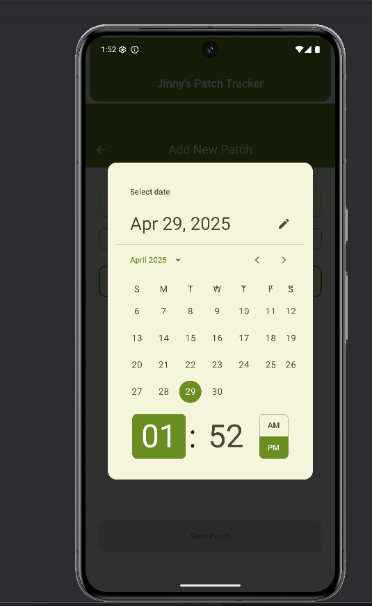

# Jinny's Patch Tracker

<p align="center">
  
  
  
</p>

---

**Jinny's Patch Tracker** is a simple and intuitive Android app designed for individuals undergoing Hormone Replacement Therapy (HRT) who use hormone patches.  
The app helps users easily keep track of their patch change schedules, ensuring consistency and peace of mind.

Built with [Jetpack Compose](https://developer.android.com/jetpack/compose) and [Kotlin](https://kotlinlang.org/), Jinny's Patch Tracker offers a clean, modern interface and seamless user experience. Google Ads integration helps support ongoing development.

---

## Features

- **Patch Change Reminders**: Get timely notifications for when it's time to change your hormone patch.
- **Simple Scheduling**: Customize patch change intervals to match your therapy plan.
- **Progress Tracking**: View history of past patch changes to monitor adherence.
- **Minimalist Design**: Built with Jetpack Compose for a clean, responsive UI.
- **Google Ads Integration**: Non-intrusive ads help keep the app free and maintained.

---

## Tech Stack

- **Language**: Kotlin
- **UI Framework**: Jetpack Compose
- **Architecture**: MVVM (Model-View-ViewModel) pattern
- **Ads**: Google AdMob integration
- **Build Tools**: Gradle, Android Studio

---

## Getting Started

### Prerequisites
- Android Studio Iguana (or later)
- Android SDK 33+
- Kotlin 1.9+
- Access to a device or emulator running Android 8.0 (API level 26) or higher

### Installation

1. **Clone the repository:**
   ```bash
   git clone https://github.com/imknott/jinnys_patch_tracker.git
   cd jinnys_patch_tracker
   ```

2. **Open the project in Android Studio.**

3. **Build and run** on your preferred device or emulator.

4. **(Optional)**: Set up your own Google AdMob keys if you're planning to distribute.

---

## 📸 Screenshots

Here are some previews of Jinny's Patch Tracker in action:

| Home Screen | Add Patch Screen | Journal History Screen |
| :---------: | :--------------: | :-------------------: |
|  |  |  |


---

## Ads Integration

Jinny's Patch Tracker uses **Google AdMob** to serve banner ads.  
If you plan to fork or distribute your own version, remember to:
- Replace AdMob App ID and Ad Unit IDs with your own.
- Comply with Google's Ad Policies.

---

## Contributing

Contributions are always welcome!  
Please read the [CONTRIBUTING.md](Contributing.md) for details on the code of conduct, and the process for submitting pull requests.

---

## License

This project is licensed under the MIT License - see the [LICENSE](LICENSE) file for details.

---

## Acknowledgements

- [Jetpack Compose](https://developer.android.com/jetpack/compose)
- [Kotlin](https://kotlinlang.org/)
- [Google AdMob](https://developers.google.com/admob)

---

## Contact

If you have any questions, feel free to open an issue or reach out!
